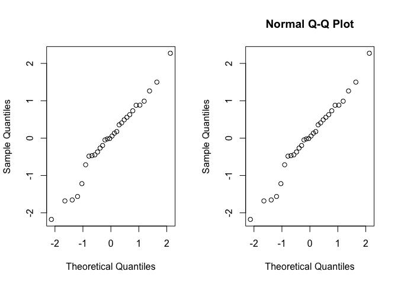
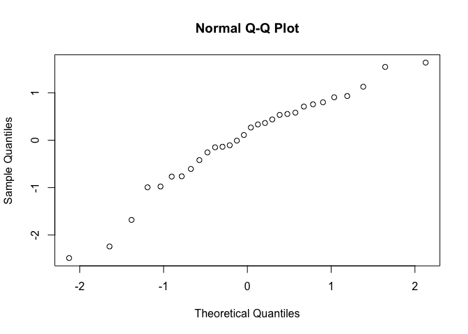

<!-- README.md is generated from README.Rmd. Please edit that file -->

# quantiles

<!-- badges: start -->

<!-- badges: end -->

The goal of package “quantiles” is to supply the tool for calculating
theoretical quantiles of the data and therefore could be used for
diagnosing the distribution of the data.

### Installation

``` r
devtools::install_github("Seren1127/quantiles")
```

### Example

This is a basic example which shows you how to solve a common problem:

``` r
library(quantiles)

set.seed(1)
data<-rnorm(30)
results<-normal_scores(data)
plot(results$normal_score, results$standard_score, 
     xlab = "Theoretical Quantiles", ylab = "Sample Quantiles", main = "Normal Q-Q Plot")
```



``` r
qqnorm((data-mean(data))/sd(data)) # results in same plot
```



### Explanation of working

I created this package by following steps.

##### 1\. Create Package

``` r
devtools::create_package("quantiles")
library(devtools)
library(roxygen2)
use_git()
use_r("normal_scores")
```

In this step, I created R package project by `devtools::create_package`.

Also, `normal_scores.R` was created by `use_r` and this contains the
function content.

##### 2\. Explain with README

I created README and rendered it by following commands.

``` r
use_readme_rmd()
build_readme()
```

##### 3\. Test

I made tests for `normal_scores` by `use_test`.

``` r
use_test("normal_scores")
test() # Tests all tests in `tests` folder.
```

##### 4\. Documentate Package

Finally, I made and edited documentations, including DESCRIPTION,
Roxygen, and vignette for usage of `normal_scores`.

Also, this package has the dependency on `stats` package, so import that
package using `use_package`

``` r
# Code -> Insert Roxygen Skeleton
document()

use_mit_license("Seren Lee")

use_package("stats")

use_vignette("normal_scores")
build_vignettes()
```

##### 5\. Check

To check the package,

``` r
check()
```

### Similar Working Function in Another Package

`cscores` in `exactRankTests` is also possible to return the normal
scores.

But since this function uses different order statistics, so the output
is slightly different.
